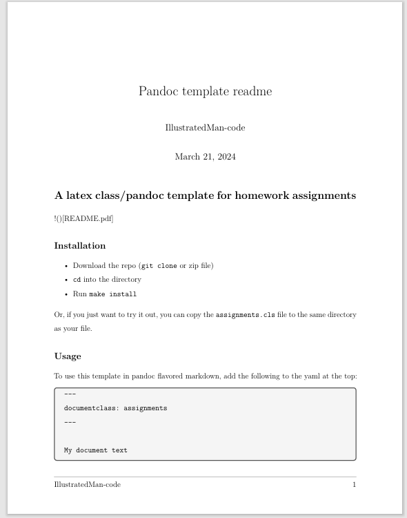
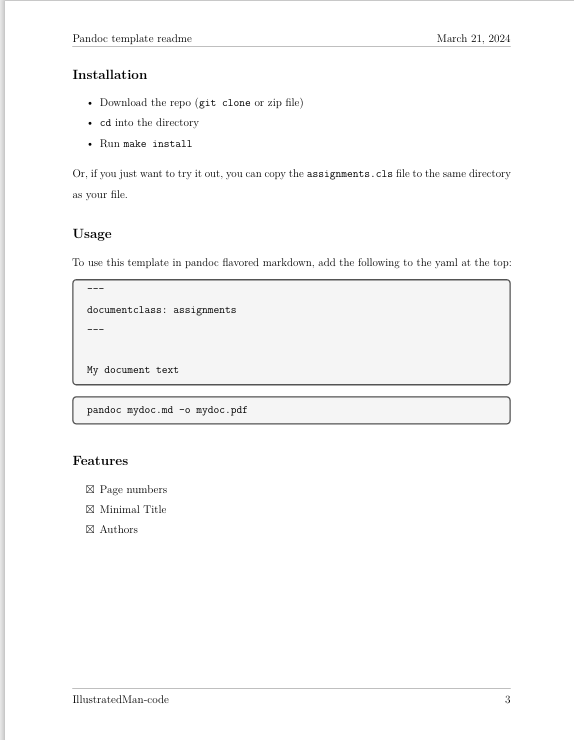

# A latex class/pandoc template for homework assignments


## Installation

- Download the repo (`git clone` or zip file)
- `cd` into the directory
- Run `make install`

Or, if you just want to try it out, you can copy the `assignments.cls` file to the same directory as your file.

## Usage

To use this template in pandoc flavored markdown, add the following to the yaml at the top:

``````
---
documentclass: assignments
---

My document text
``````

```bash
pandoc mydoc.md -o mydoc.pdf
```

## Features
- [X] Page numbers
- [X] Minimal Title
- [X] Authors

## Screenshots
You can also just look at README.pdf




